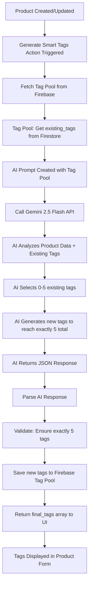

# Tag Generation Flow

## How the AI Tag Generation System Works



## Key Components

### 1. Firebase Tag Pool (`tag_pools/candle_tags`)
```typescript
interface TagPool {
  existing_tags: {
    scent_families: string[];    // ['floral', 'woody', 'citrus']
    materials: string[];         // ['soy-wax', 'wooden-wick']
    occasions: string[];         // ['gift', 'self-care', 'meditation']
    moods: string[];            // ['calming', 'energizing', 'cozy']
    seasons: string[];          // ['spring', 'summer', 'fall']
    brand_values: string[];     // ['handmade', 'premium']
    auto_generated: string[];   // AI-generated tags
  };
  usage_count: Record<string, number>;  // Track tag popularity
  last_updated: string;
}
```

### 2. AI Prompt Strategy
- **Input**: Product data + existing tag pool
- **Process**: 
  1. Select relevant existing tags (0-5)
  2. Generate new tags to reach exactly 5 total
  3. Ensure SEO-friendly format (lowercase, hyphenated)
- **Output**: JSON with selected_existing, new_tags, final_tags

### 3. Learning System
- New tags are saved to `auto_generated` category
- Usage count is tracked for popularity
- Tag pool grows over time with successful AI suggestions

## Current Tag Format
- **Format**: lowercase, hyphenated (e.g., "spa-night", "luxury-candle")
- **Count**: Exactly 5 tags per product
- **Categories**: scent_families, materials, occasions, moods, seasons, brand_values, auto_generated

## Requested Change
- **Current**: Tags are lowercase and hyphenated
- **Requested**: Tags should be capitalized (e.g., "Spa Night", "Luxury Candle")
- **Impact**: Need to update AI prompt and possibly tag pool storage format
