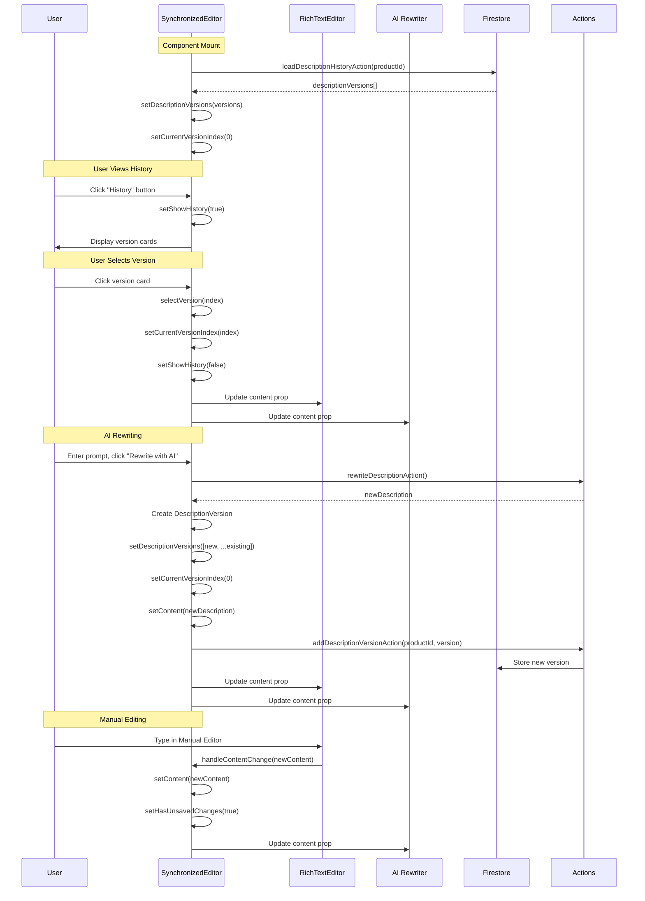
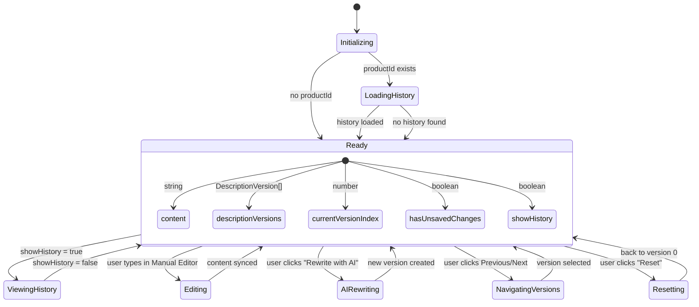
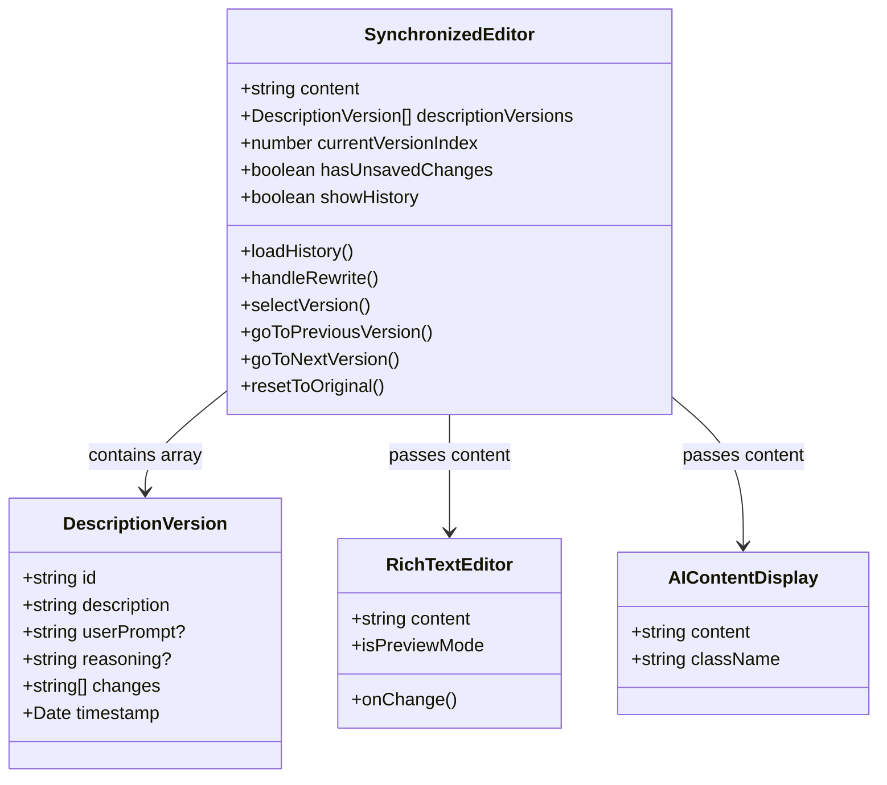

# Version History Feature Flow Diagram

## Overview
The history feature in SynchronizedEditor provides version control for product descriptions, allowing users to track AI-generated changes and revert to previous versions.

## Main Flow Diagram

```mermaid
graph TD
    subgraph "SynchronizedEditor Component"
        A[User interacts with SynchronizedEditor] --> B{Show History button clicked?}
        B -->|Yes| C[setShowHistory(true)]
        C --> D[Render Version History UI]
        
        E[Component mounts] --> F[useEffect: Load description history]
        F --> G{productId exists?}
        G -->|Yes| H[Call loadDescriptionHistoryAction(productId)]
        G -->|No| I[Initialize with 'initial' version only]
        H --> J{Success with versions?}
        J -->|Yes| K[setDescriptionVersions(versions)]
        J -->|No/Error| I
        K --> L[setCurrentVersionIndex(0)]
        
        D --> M[Render list of DescriptionVersion Cards]
        M --> N{User clicks a version Card?}
        N -->|Yes| O[selectVersion(index)]
        O --> P[setCurrentVersionIndex(index)]
        P --> Q[setShowHistory(false)]
        Q --> R[Update displayed content to selected version]
        R --> S[Manual Editor & AI Rewriter display selected version]
    end

    subgraph "AI Rewriting Flow (adds new version)"
        T[User enters prompt & clicks 'Rewrite with AI'] --> U[handleRewrite() called]
        U --> V[Call rewriteDescriptionAction()]
        V --> W{Success?}
        W -->|Yes| X[Create new DescriptionVersion object]
        X --> Y[setDescriptionVersions(prev => [newVersion, ...prev])]
        X --> Z[setCurrentVersionIndex(0) - new version is latest]
        X --> AA[setContent(newVersion.description)]
        AA --> BB[Call addDescriptionVersionAction(productId, newVersion)]
        BB --> CC[Toast: "Description Enhanced"]
        W -->|No| DD[Toast: "AI Rewrite Failed"]
    end

    subgraph "Version Navigation"
        EE[User clicks 'Previous' button] --> FF[goToPreviousVersion()]
        FF --> GG{currentVersionIndex < descriptionVersions.length - 1?}
        GG -->|Yes| HH[setCurrentVersionIndex(prev + 1)]
        GG -->|No| II[Button disabled]
        
        JJ[User clicks 'Next' button] --> KK[goToNextVersion()]
        KK --> LL{currentVersionIndex > 0?}
        LL -->|Yes| MM[setCurrentVersionIndex(prev - 1)]
        LL -->|No| NN[Button disabled]
        
        OO[User clicks 'Reset' button] --> PP[resetToOriginal()]
        PP --> QQ[setCurrentVersionIndex(0)]
        QQ --> RR[setShowHistory(false)]
        RR --> SS[Toast: "Reset to Original"]
    end

    subgraph "Data Persistence"
        BB --> TT[Firebase Firestore stores DescriptionVersion objects]
        H --> TT
        TT --> UU[descriptionVersions state updated]
    end

    subgraph "Content Synchronization"
        AA --> VV[content state updated]
        VV --> WW[RichTextEditor receives new content]
        WW --> XX[Manual Editor displays updated content]
        VV --> YY[AIContentDisplay receives new content]
        YY --> ZZ[AI Rewriter displays updated content]
    end

    style A fill:#e1f5fe
    style T fill:#f3e5f5
    style EE fill:#fff3e0
    style JJ fill:#fff3e0
    style OO fill:#fff3e0
    style BB fill:#e8f5e8
    style TT fill:#e8f5e8
```

## Detailed Component Interactions



## State Management Flow



## Data Structures



## Key Features Working

✅ **Version History Loading**: Loads from Firestore on mount
✅ **Version Selection**: Click any version to switch content
✅ **AI Rewriting**: Creates new versions and adds to history
✅ **Navigation Controls**: Previous/Next buttons work
✅ **Reset Function**: Returns to original version
✅ **Content Synchronization**: Manual Editor and AI Rewriter stay in sync
✅ **Persistence**: New versions saved to Firestore
✅ **UI Feedback**: Toasts for success/error states

## Potential Issues to Check

🔍 **Version Index Management**: Ensure currentVersionIndex stays in bounds
🔍 **Content Sync**: Verify both editors update when version changes
🔍 **History Loading**: Check if productId is correctly passed
🔍 **Error Handling**: Verify graceful handling of Firestore errors
🔍 **Performance**: Large version arrays might need pagination

The history feature appears to be fully implemented and working based on the code structure and the UI shown in your image!
